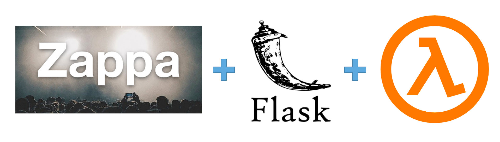

### zappa app guide

[Zappa](https://github.com/zappa/Zappa) - Deploy a Serverless Web App on AWS Lambda with Zappa 



#### Security Policy for `IAM` Group
1. Create Group,
2. Create user and add the user to created group
3. Create policy with below json & attach the policy to the user/group.
```{
    "Version": "2012-10-17",
    "Statement": [
      {
        "Effect": "Allow",
        "Action": [
          "iam:AttachRolePolicy",
          "iam:GetRole",
          "iam:CreateRole",
          "iam:PassRole",
          "iam:PutRolePolicy"
        ],
        "Resource": [
          "arn:aws:iam::XXXXXXXXXXXXXX:role/*-ZappaLambdaExecutionRole"
        ]
      },
      {
        "Effect": "Allow",
        "Action": [
          "apigateway:DELETE",
          "apigateway:GET",
          "apigateway:PATCH",
          "apigateway:POST",
          "apigateway:PUT",
          "events:DeleteRule",
          "events:DescribeRule",
          "events:ListRules",
          "events:ListRuleNamesByTarget",
          "events:ListTargetsByRule",
          "events:PutRule",
          "events:PutTargets",
          "events:RemoveTargets",
          "lambda:AddPermission",
          "lambda:CreateFunction",
          "lambda:DeleteFunction",
          "lambda:GetAlias",
          "lambda:GetFunction",
          "lambda:GetFunctionConfiguration",
          "lambda:GetPolicy",
          "lambda:InvokeFunction",
          "lambda:ListVersionsByFunction",
          "lambda:RemovePermission",
          "lambda:UpdateFunctionCode",
          "lambda:UpdateFunctionConfiguration",
          "cloudformation:CreateStack",
          "cloudformation:DeleteStack",
          "cloudformation:DescribeStackResource",
          "cloudformation:DescribeStacks",
          "cloudformation:ListStackResources",
          "cloudformation:UpdateStack",
          "cloudfront:UpdateDistribution",
          "logs:DeleteLogGroup",
          "logs:DescribeLogStreams",
          "logs:FilterLogEvents",
          "route53:ListHostedZones"
        ],
        "Resource": [
          "*"
        ]
      },
      {
        "Effect": "Allow",
        "Action": [
          "s3:CreateBucket",
          "s3:ListBucket",
          "s3:ListBucketMultipartUploads"
        ],
        "Resource": [
          "arn:aws:s3:::zappa-*"
        ]
      },
      {
        "Effect": "Allow",
        "Action": [
          "s3:DeleteObject",
          "s3:GetObject",
          "s3:PutObject",
          "s3:AbortMultipartUpload",
          "s3:ListMultipartUploadParts"
        ],
        "Resource": [
          "arn:aws:s3:::zappa-*/*"
        ]
      }
    ]
  }


```
### Set Up & Install dependencies 

```
python -m venv venv
source venv/bin/activate
pip install -r requirements.txt

```
### To run

#### Run Locally

    flask run

#### AWS credentials

Log into AWS IAM, create a new user with admin credentials in `~/.aws/credentials`
```
[zappa]
aws_access_key_id = XXXXXXXXXXXXXXXXXXXXXXXXXX
aws_secret_access_key = XXXXXXXXXXXXXXXXXXXXXXXXXXXXXXXXXX
```

#### Run Zappa init

    pip install flask zappa

#### create `app.py`
    
    zappa init

#### Modify `zappa_setting.json`

profile name comes from `.aws/credentials`. aws_region needs to be set, all others from zappa init are OK
```
{
    "dev": {
        "app_function": "app.app",
        "aws_region": "ca-central-1",
        "profile_name": "zappa",
        "project_name": "zappa-app",
        "runtime": "python3.8",
        "s3_bucket": "zappa-3svvqthav"
    }
}
```

#### Deploy
    zappa deploy dev

#### Make changes and update
    zappa update dev

#### Delete the app
    zappa undeploy dev
